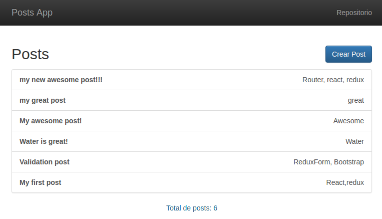

# Post App
Web app of posts with React and Redux




## Folder Structure

```
.
├── src
│   ├── actions
│   │   └── posts.action.js
│   ├── components
│   │   ├── common
│   │   │   └── Header.jsx
│   │   ├── App.jsx
│   │   ├── NotFound.jsx
│   │   ├── PostDetail.jsx
│   │   ├── PostItem.jsx
│   │   └── PostNew.jsx
│   ├── containers
│   │   └── PostIndex.jsx
│   ├── reducers
│   │   ├── index.js
│   │   └── posts.reducer.js
│   ├── store
│   │   ├── config.dev.js
│   │   ├── config.prod.js
│   │   └── index.js
│   ├── index.css
│   ├── index.js
│   └── routes.js
├── index.html
├── package.json
├── README.md
├── tree
├── webpack.config.js
└── webpack.config.prod.js

7 directories, 22 files
```

## Available Scripts

In the project directory, you can run:

### `npm start`

Runs the app in the development mode.<br>
Open [http://localhost:3000](http://localhost:3000) to view it in the browser.

The page will reload if you make edits.<br>
You will also see any lint errors in the console.

### `npm run build`

Builds the app for production to the `dist` folder.<br>
It correctly bundles React in production mode and optimizes the build for the best performance.
